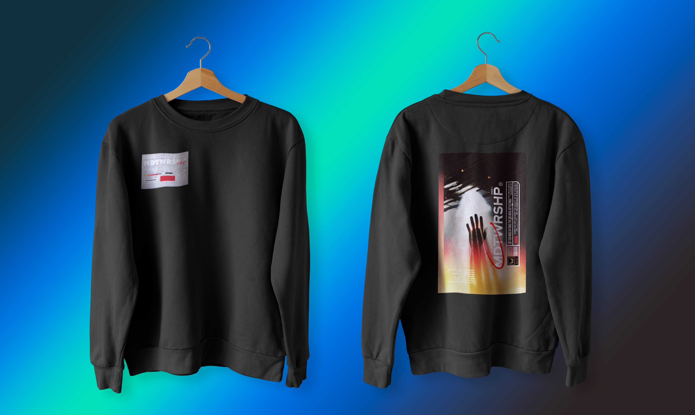

# IDP_kiel_saif_hw1
This repo is for our Home Work 1 in MMED 1054

# Project Name:  
### IDP Kiel&Saif Goats 

Project Description: This is our first project made after learning Github. This project shows what we learn in this program. Wishing you a great day if you read this 🦾.

## Installation 

N/A

## Usage 

N/A

## Contributing

1. Fork it!
2. Create your feature branch: git checkout -b my-new-feature
3. Commit your changes: git commit -am 'Add some feature'
4. Push to the branch: git push origin my-new-feature
5. Submit a pull request :D

## History

October 4, 2023

## Credits 

Ezekiel John Celis, Saif Abusaad

## License 

MIT License

---

# Group Information

## Ezekiel John Celis

#### Hi! I'm Ezekiel, but you can call me Kiel or Zek. I'm a chill dude, friendly, and approachable, and I really like sisig, which is one of the dishes in my country. I was born in Iloilo City, known as the City of Love in the Philippines.

##

#### This photo is a clothing line that i made a few months ago. The colors, patterns, and style matched from what idea i got, and its really cool that i blends together. I just really think that this design is cool!

**My 5 Favorite Movies/TV Series**

* *Interstellar*
* *Dark*
* *Mr. Robot*
* *Shutter Island*
* *Fight Club*

__Hobbies__

- Basketball 
+ Editing 
- Online Games
* Cooking 

**MY Favorite Website**

[NETFLIX](www.netflix.com)

##
##

## Saif Abusaad

### Hi my name is saif, I like sports like tennis, MMA and basketball but i mostly enjoy art because its my passion, I also travel alot. Im born in Amman the capital of jordan. 

##

#### This is a photo of the place where my family is orginated from. I like this photo because it gives me hope that I might vist this place in the future

**My top 5 Favorite Movies**

* *Wolf of The Wall Street*
* *Kingdom of Heaven*
* *Scar face*
* *Focus*
* *American Psycho*

__Hobbies__

1. Sports
2. Cooking
3. Drawing 
4. Playing Chess

***My Favorite Website***

[Spotify](www.spotify.com)